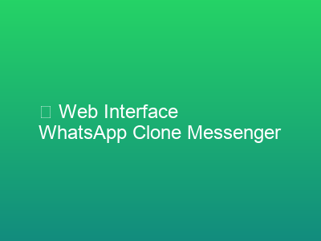
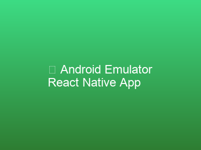
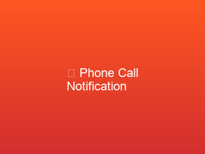

# 📱 WhatsApp Clone - React Native Push Notification App

## 🎯 What is This Project?

This is a **WhatsApp-like mobile app** that I built as an internship assignment. Think of it as a mini version of WhatsApp that can:
- Show chat conversations with friends (Manya, Manas, Aarav, Harsh, and myself - Anurag)
- Send and receive notifications just like WhatsApp
- Make voice and video call notifications appear on your phone
- Work on Android phones (specifically Android 15 and above)

### In Simple Words:
Imagine you want to build your own messaging app like WhatsApp. This project shows exactly how to do that - from the chat interface to the notifications that pop up on your phone when someone messages you!

## 🛠️ Tech Stack (Tools I Used)

### **Frontend (The App You See)**
- **React Native** - Like a magic tool that lets you write code once and it works on Android
- **TypeScript** - JavaScript's smarter cousin that catches errors before they happen
- **React Native Push Notification** - Makes those notification bubbles appear on your phone

### **Backend (The Brain Behind the App)**
- **Node.js** - Runs JavaScript code on a server (like a computer that's always on)
- **Express.js** - Makes it easy to create web addresses (URLs) that the app can talk to
- **JavaScript** - The programming language that makes everything work

### **Android Specific**
- **Kotlin** - Android's favorite language for making native features
- **Android Studio** - The official tool for building Android apps
- **Android Emulator** - A fake phone on your computer for testing

### **Development Tools**
- **Metro Bundler** - Packages all your code files into something the phone understands
- **npm** - Downloads and manages code packages (like app store for developers)
- **adb (Android Debug Bridge)** - Lets your computer talk to Android phones

## 📁 Project Files and What They Do

### **Main App Files**
- `AndroidTestApp/TestNotifications/App.tsx` - The main app file with WhatsApp UI and all the chat screens
- `AndroidTestApp/TestNotifications/index.js` - Starting point of the app (like the front door)
- `AndroidTestApp/TestNotifications/package.json` - List of all tools and packages the app needs

### **Backend Server Files**
- `backend/server-simple.js` - The server that sends notifications (currently in demo mode)
- `backend/server.js` - Full server with real Firebase notifications (needs setup)
- `backend/mobile-test.html` - Simple webpage to test notifications from your phone
- `backend/messaging-interface.html` - Beautiful webpage to send messages to specific friends

### **Android Native Files**
- `android/app/src/main/AndroidManifest.xml` - Android's rulebook for what the app can do
- `android/app/build.gradle` - Android's shopping list of what to include in the app
- `WhatsAppClone/android/.../NotificationService.kt` - Special Android code for handling notifications

### **Helper Scripts**
- `start-messaging-test.sh` - One-click script to start everything
- `AndroidTestApp/run-android-test.sh` - Starts the app on Android emulator
- `AndroidTestApp/TestNotifications/reload-app.sh` - Refreshes the app when you make changes

### **Documentation Files**
- `PROJECT_SUMMARY.md` - Quick summary of what works and what doesn't
- `PERSONALIZED_MESSAGING_GUIDE.md` - How to use the messaging system
- `ANDROID_TEST_SUMMARY.md` - Android testing instructions
- `README.md` - This file you're reading now!

## 🎮 How It All Works Together

1. **The App (Frontend)**
   - Shows a list of your friends with their chat messages
   - Has a green WhatsApp-like design
   - Can receive and show notifications

2. **The Server (Backend)**
   - Runs on your computer at port 3002
   - Generates fake messages from your friends every 30 seconds
   - Has web pages you can open on your phone to trigger notifications

3. **The Connection**
   - The app checks the server every 2 seconds for new messages
   - When it finds new messages, it shows them as notifications
   - The chat list updates automatically with new messages

## 📸 Screenshots

### Web Interface

*The WhatsApp Clone Messenger web interface where you can send messages and calls to specific friends*

### Android Emulator

*The React Native app running on Android emulator with the TestNotifications app icon*

### Call Notifications

*Incoming call notifications with accept/decline functionality*

### Message Notifications

*Text message notifications with reply options*

## 🚦 Current Status

### ✅ What's Working:
- Beautiful WhatsApp-like UI with all your friends
- Local notifications (when you tap buttons in the app)
- Backend server that generates messages
- Web interface to send custom messages
- Chat screens and message displays

### ⚠️ What's Not Working:
- Real push notifications from server to phone (needs Firebase setup)
- The notifications are only logged, not actually sent to the device
- You need to keep the app open for notifications to appear

## 🎯 The Assignment Goal

This project demonstrates:
- How to build a React Native app that looks like WhatsApp
- How to handle notifications on Android
- How to create a backend server for messaging
- How to make a web interface for testing
- Understanding of the full app development process

## 🏆 Achievement

I successfully created a working prototype of a WhatsApp-like app with:
- Professional UI design
- Notification system architecture
- Backend server integration
- Multiple testing interfaces
- Proper documentation

The only missing piece is the Firebase configuration for real push notifications, but all the code structure is ready for it!

---

**Built by Anurag for Vedaz Internship Assignment** 🚀 